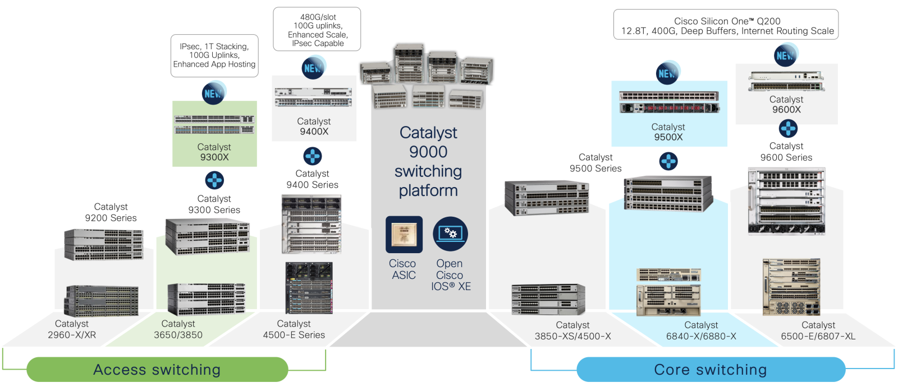

# Physical Sandbox Guides
Use these guides to learn how to leverage the DevNet Physical Sandboxes!

## Table of Contents
- [Access Details](#access-details)
- [Sandbox Overview](#sandbox-overview)
- [Programmability Overview](#programmability-overview)
- [9200](#9200)
- [9300](#9300)
- [Resources](#resources)

## Access Details
Developer reserves the Lab and receives software VPN access information and credentials via email at the start of the reservation. Once connected via software VPN the developer can access the lab's devices and server via Telnet/SSH/HTTP.

| Address | username | password  |
| --- | --- | ---  |
| 10.10.20.181 | developer | C1sco12345 |

### Ports

* Catalyst 9000 Host: 10.10.20.181 (After VPN connection)  
    * SSH Port: 22  
    * NETCONF Port: 830  
    * RESTCONF Ports: 443  

*Do not change the credentials for, or remove any user credentials configured on the sandbox.*

> **IMPORTANT NOTE:** Do not try to reload the physical switch in your sandbox, or change the software image running.  This will result in your loss of access to your switch as it is rebaselined back to default and prepared for the next reservation.

### VPN Information

[VPN access information for Windows, MAC and Linux](https://developer.cisco.com/docs/sandbox/#!getting-started/sandbox-vpn-info)

## Sandbox Overview

There are a few options within this phyiscal sandbox:
1. **9300X Standalone** (4 devices): In this guide, you will be able to work with a single (non-stacked) 9300 running Cisco IOS XE 17.15 with NETCONF & RESTCONF enabled.

1. **9300 Standalone** (15 devices): In this guide, you will be able to work with a single (non-stacked) 9300 running Cisco IOS XE 17.15 with NETCONF & RESTCONF enabled.

1. **9300L or 9300LM Stack** (6 devices divided into 2-member stacks each): This guide you will be able to work with a 9300 stack running Cisco IOS XE 17.15 with NETCONF & RESTCONF enabled. Note: There is no SSD for app-hosting use case.

1. **9200CX Standalone** (1 device): In this guide, you will be able to work with a single (non-stacked) 9200 running Cisco IOS XE 17.15 with NETCONF & RESTCONF enabled. Note: App hosting is not available on this SKU.

1. **9200 Stack** (2 devices in a 2-member): In this guide, you will be able to work with a 9200 stack running Cisco IOS XE 17.15 with NETCONF & RESTCONF enabled. Note: App hosting is not available on this SKU.

The **IOS XE on Catalyst 9000** Sandbox offers developers access to a physical Catalyst 9000 switch running release 17.15 IOS XE.  Here, you can test out the programmability features and data models available in this version. 

Some of the programmability features developers and network engineers can explore include:  

*   Model Driven Programmability with YANG Data Models and NETCONF and RESTCONF
*   Linux Guest Shell on-box for running Linux Applications and run Python Scripts directly at the at the edge.
*   Application Hosting allows application developers and network engineers to build and deploy applications (custom or off the shelf) on the network device

**IMPORTANT NOTE:** This sandbox is not built to support testing of Day 0 Technologies such as ZTP, iPXE, and PNP.  If you try to clear out configurations and use these features you will lose access to your switch.  

IOS XE is the software running on many platforms from Cisco including switches, routers, gateways, etc. Not all programmability features are available on every platform. Check specific platform documentation for details.

New Application Hosting Features available in this release:  

IOS XE 17.15 on Catalyst 9300 provides developers new application hosting capabilities. Developers can create their own docker container based apps and use Catalyst 9300 to host these apps. **Note: the app hosting capabilities are not supported on 9200 switches.**

## Programmability Overview

[YANG Suite](https://github.com/CiscoDevNet/yangsuite) is HTML5 based tooling that is available for working with the YANG based programmable interfaces on Cisco IOS XE, XR, and NX Network Operating Systems. It has plugins that allow for interacting with the programmable interfaces and supports downloading YANG files directly from network devices. In this module, we will explore using NETCONF and RESTCONF to configure a switch and we will create a gRPC telemetry subscriptions.

This guide has the following sections:
- [NETCONF](https://github.com/CiscoDevNet/yangsuite/blob/main/examples/NETCONF.md)
- [RESTCONF](https://github.com/CiscoDevNet/yangsuite/blob/main/examples/RESTCONF.md)
- [gNMI](https://github.com/CiscoDevNet/yangsuite/blob/main/examples/gNMI.md)

### Learn more about YANG Suite
- [YANG Suite GitHub](https://github.com/CiscoDevNet/yangsuite)
- [YANG Suite on DevNet](https://developer.cisco.com/yangsuite/)

### YANG Suite Videos
- [Getting started with Cisco YANG Suite](https://youtu.be/smrhjL5Ayz0)
- [All YANG Suite, all the time, DevNet Snack Minute, Episode 9](https://www.youtube.com/watch?v=3zmNDfn8b38)
- [NETCONF with YANG Suite](https://www.youtube.com/watch?v=dTun33611JA)

###  Benefits

* **Easier hosting:** Create, deploy and run applications easily by making use of the ability to host docker containers on Catalyst 9000 series.
* **Enhanced agility:** Drive greater business agility as developers can quickly develop applications and deploy them where needed.

The sandbox provides developers an environment to experiment with Application Hosting on IOS XE. To understand the benefits of Application Hosting, developers can create their own apps in the developer environment or bring in their own apps. These apps can then be deployed using the Catalyst 9300 that the developer has reserved.

## 9200 
Catalyst 9200 switches have many benefits and support L3 features such as OSPF, EIGRP, ISIS, RIP, and routed access. The C9200-24P includes 24 ports with full PoE+ support. In addition, the 9200CX supports basic BGP.

One of the major values of a switching stack is high availability. For more details and scenarios, check out the 9200 stacking configuration guide: https://www.cisco.com/c/en/us/td/docs/switches/lan/catalyst9200/software/release/17-15/configuration_guide/ha/b_1715_stck_mgr_ha_9200_cg.html

**Note: 9200 switches do not support app hosting**

## 9300 
Catalyst 9300 switches have many benefits including enhanced high availability features such as Extended Fast Software Upgrade (xFSU), Stateful Switchover (SSO), Software Maintenance Upgrades (SMU), Graceful Insertion and Removal (GIR), Cisco StackWise® and StackPower technology. Further, it supports all the foundational high-availability capabilities, including Platinum-efficient dual redundant power supplies and variable-speed, high-efficiency, redundant fans. Additionally, the 9300 has app hosting support, described in more detail below.

One of the major values of a switching stack is high availability. For more details and scenarios, check out the 9300 stacking configuration guide: https://www.cisco.com/c/en/us/td/docs/switches/lan/catalyst9300/software/release/17-15/configuration_guide/stck_mgr_ha/b_1715_stck_mgr_ha_9300_cg.html

### App Hosting Overview

Application Hosting can be used by development and operations (DevOps) personnel who plan to optimize networks by collecting analytics of the network in real-time, locate where problems occur, and investigate issues in a collaborative manner in order to maintain the health of the network.

**Note:** App hosting is only available on 9300 sandboxes, NOT on the 9200 sandboxes. In this particular sandbox, the 9300L does not have an external SSD, meaning App Hosting is not available within this sandbox. However, please note that with an SSD, the 9300L switch does support app hosting. 

Catalyst 9000 series switches were built to support Intent Based Networking. The switches can now support native docker applications. 

Docker helps in easy portability of applications, version controlling and expedites the devops cycle. You can now securely deploy the apps right next to mission critical infrastructure. Process and files access for apps are isolated and restricted making it completely safe and secure. Application Hosting solution on Catalyst 9000 series provides the much needed intelligence at the edge.

## Resources
* [9200 Data Sheet](https://www.cisco.com/c/en/us/products/collateral/switches/catalyst-9200-series-switches/nb-06-cat9200-ser-data-sheet-cte-en.html)
* [9300 Data Sheet](https://www.cisco.com/c/en/us/products/collateral/switches/catalyst-9300-series-switches/nb-06-cat9300-ser-data-sheet-cte-en.html)
* [Cisco Catalyst 9000 Switching Platform FAQ](https://www.cisco.com/c/en/us/products/collateral/switches/catalyst-9000/nb-06-cat9k-swit-plat-faq-cte-en.html)
* [9200 configuration guides by release](
https://www.cisco.com/c/en/us/support/switches/catalyst-9300-series-switches/products-installation-and-configuration-guides-list.html)
* [9300 configuration guides by release](https://www.cisco.com/c/en/us/support/switches/catalyst-9300-series-switches/products-installation-and-configuration-guides-list.html)
* [DevNet Python Code Samples](https://github.com/CiscoDevNet/python_code_samples_network)  
* [SBX Sandbox](https://github.com/DevNetSandbox/sbx_iosxe)  
* [IOS XE on DevNet](https://developer.cisco.com/site/ios-xe/)
* [Application Hosting on IOS XE on DevNet](https://developer.cisco.com/app-hosting/)
* [Model Driven Programmability on DevNet](https://developer.cisco.com/site/standard-network-devices/)
* [Python for Network Automation on DevNet](https://developer.cisco.com/site/python/)

> Samples are being developed across these features and added as you read this so check back often!!  

### Learning Labs:
Here are some Learning Labs where you can get some guided walkthroughs of features.  

* ["Introduction to Model Driven Programmability (ex: NETCONF/YANG)" Learning Module](https://learninglabs.cisco.com/modules/intro-device-level-interfaces)
* [Introduction to Guest Shell on IOS XE](https://learninglabs.cisco.com/modules/net_app_hosting)