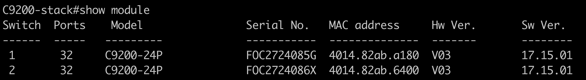
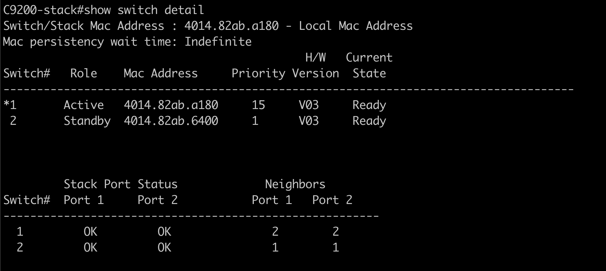

# 9200 Stack-specific tutorial

## Understanding your stack
Once you login to the 9200 stack, 
1. Run `show switch detail` to understand which types of switches are in your stack and which version of code they are running

1. Run `show module` to understand which switch is active and which is standby as well as the priorities. A switch with higher priority will be the active switch

1. One of the major values of a switching stack is high availability. For more details and scenarios, check out the 9200 stacking configuration guide: https://www.cisco.com/c/en/us/td/docs/switches/lan/catalyst9200/software/release/17-15/configuration_guide/ha/b_1715_stck_mgr_ha_9200_cg.html

**Note: 9200 switches do not support app hosting**