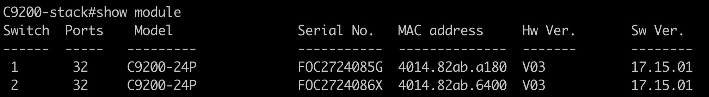
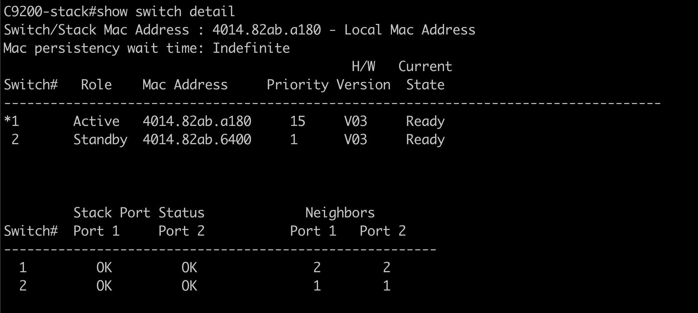

# 9200 Stack-specific tutorial

## Understanding your stack
Once you login to the 9200 stack, 
1. Run `show switch detail` to understand which types of switches are in your stack and which version of code they are running

1. Run `show module` to understand which switch is active and which is standby as well as the priorities. A switch with higher priority will be the active switch

Tutorial ideas
1. OSPF or another L3 feature
1. guest shell + python scripts to work with API on box
1. do we have YS easily accessible in this environment?
1. telemetry - do we have receiver in this environment?

### Why 9200? 
Catalyst 9200 switches have many benefits support L3 features such as OSPF, EIGRP, ISIS, RIP, and routed access. The C9200-24P includes 24 ports with full PoE+ support. In addition, the 9200CX supports basic BGP.

One of the major values of a switching stack is high availability. For more details and scenarios, check out the 9200 stacking configuration guide: https://www.cisco.com/c/en/us/td/docs/switches/lan/catalyst9200/software/release/17-15/configuration_guide/ha/b_1715_stck_mgr_ha_9200_cg.html

**Note: 9200 switches do not support app hosting**

## Resources
* [9200 Data Sheet](https://www.cisco.com/c/en/us/products/collateral/switches/catalyst-9200-series-switches/nb-06-cat9200-ser-data-sheet-cte-en.html)

